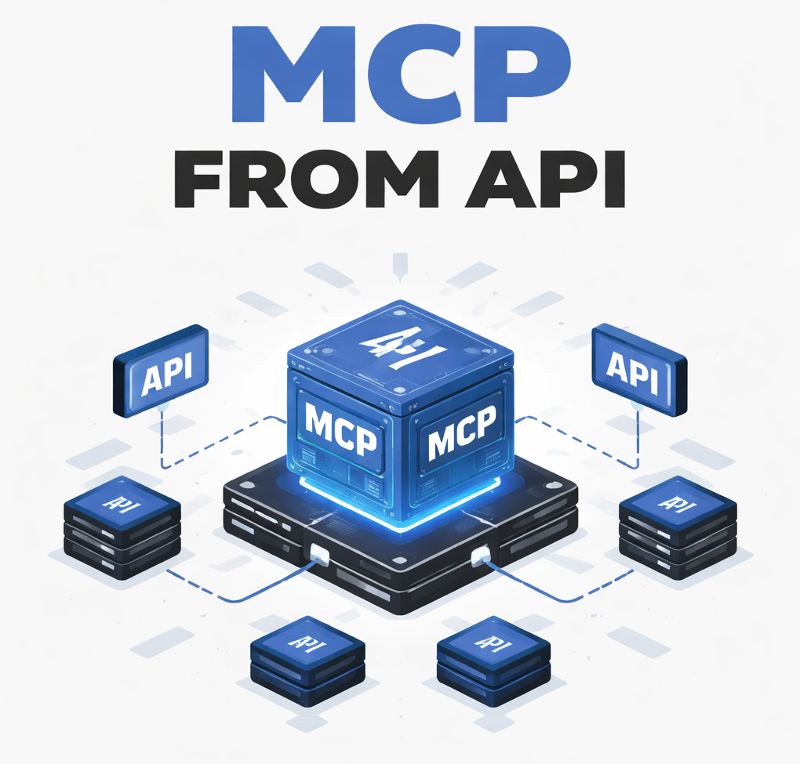

# MCP from API

A **configurable Model Context Protocol (MCP) server** that exposes arbitrary HTTP APIs as MCP tools, driven entirely by a JSON config.

[](https://deploy.workers.cloudflare.com/?url=https://github.com/OWNER/REPO)

Instead of hardcoding tools, you define them in `src/config/tools.config.json`. Each entry describes:

- **Tool metadata**: `name`, `description`, `inputSchema`
- **HTTP call**: method, path, optional query/body mapping, headers
- **Response shaping**: how to turn the HTTP response into MCP `result.content`

The worker runtime is still Cloudflare Workers using Wrangler.




## Environment configuration

This repo is set up to **keep local configuration out of git**:

- `wrangler.jsonc` is **gitignored** (may contain personal/internal URLs and IDs)
- `src/config/tools.config.json` is **gitignored** (may contain internal tool definitions / headers)

For open-source publishing, commit the example files and copy them locally when developing.

The server uses the `baseUrlEnvKey` from the tool config to look up the base URL in the Worker environment (see `wrangler.jsonc`).

In the default config:

- `baseUrlEnvKey` is `API_BASE_URL`
- `wrangler.jsonc` typically provides different values per environment (examples shown in `wrangler.jsonc.example`).

### Optional shared token (`authTokenEnvKey`)

You can protect the MCP endpoints and pass a secret through to your upstream API:

1. In `tools.config.json`, set **`authTokenEnvKey`** to the name of a Worker binding (same pattern as `baseUrlEnvKey`). The example uses `MCP_AUTH_TOKEN`.
2. In `wrangler.jsonc`, define that variable (or use a [secret](https://developers.cloudflare.com/workers/configuration/secrets/) for production). If the value is missing or blank, token auth is disabled: clients do not need a token, and upstream calls do not get an extra `token` query parameter.
3. When the env value is non-empty, MCP clients must send **the same string** when connecting, either:
   - as a path segment: `/mcp/<token>` or `/sse/<token>`, or
   - as `Authorization: Bearer <token>`.
4. If the client token matches the configured secret, every upstream tool request appends **`token=<that secret>`** as a query parameter (in addition to any `query` mapping from the tool config). Your API can read that parameter to authorize the call.

Static per-tool headers (for example `Authorization: Bearer ...` for the upstream API) are set only in each tool’s `http.headers` block; they are not derived from the MCP client token.

### Quick start (local)

Copy the example configs:

```bash
cp wrangler.jsonc.example wrangler.jsonc
cp src/config/tools.config.json.example src/config/tools.config.json
```

Then edit `wrangler.jsonc` / `src/config/tools.config.json` with your own values.

## Defining tools in JSON

Tools are defined in `src/config/tools.config.json` under the `tools` array.

For a commit-safe reference, see `src/config/tools.config.json.example`.

Example:

```json
{
  "server": {
    "name": "mcp-from-api",
    "version": "1.0.0",
    "description": "Configurable MCP server that exposes HTTP APIs as tools."
  },
  "baseUrlEnvKey": "API_BASE_URL",
  "authTokenEnvKey": "MCP_AUTH_TOKEN",
  "tools": [
    {
      "name": "example_get_users",
      "description": "Fetches a paginated list of users from the configured API.",
      "inputSchema": {
        "type": "object",
        "properties": {
          "page": {
            "type": "integer",
            "minimum": 1,
            "default": 1
          }
        },
        "required": [],
        "additionalProperties": false
      },
      "http": {
        "method": "GET",
        "path": "/users",
        "query": {
          "page": "page"
        },
        "headers": {}
      },
      "response": {
        "mode": "json",
        "contentPath": null,
        "wrap": {
          "type": "text",
          "template": "Users response:\\n\\n{{body}}"
        }
      }
    }
  ]
}
```

### HTTP mapping

In each tool’s `http` block:

- **`method`**: `"GET" | "POST" | "PUT" | "PATCH" | "DELETE"`
- **`path`**: joined with the base URL from the environment
- **`query`**: map of query parameter name → argument key  
  (e.g. `"page": "page"` means `args.page` becomes `?page=...`)
- **`headers`**: static headers to send on every call for that tool (from the config only).
- **`body`** (optional, for methods like `POST`/`PUT`/`PATCH`):
  - `mode: "json"`
  - `mapping`:
    - `"full"` – send the entire `arguments` object as JSON
    - `"properties"` – send only selected properties, defined in `properties`
  - `properties` (when `mapping` is `"properties"`): map of body property → argument key

### Response mapping

In each tool’s `response` block:

- **`mode`**:
  - `"json"` – parse the HTTP response body as JSON
  - `"text"` – use `response.text()`
- **`contentPath`** (optional):
  - When `mode` is `"json"`, treat this as a dotted path into the parsed JSON (e.g. `"data.items"`).
  - If omitted or not found, the entire JSON is used.
- **`wrap`** (optional):
  - Currently supports `type: "text"` with a `template` string.
  - The placeholder `{{body}}` is replaced with the stringified selected content.

The final string is always returned to MCP clients as:

```json
{
  "content": [
    {
      "type": "text",
      "text": "..."
    }
  ]
}
```

## Runtime behaviour

- `tools/list` uses the JSON config to expose all tools with their `name`, `description`, and `inputSchema`.
- `tools/call` looks up the tool by `name`, constructs the HTTP request from the config and the provided `arguments`, calls the remote API, shapes the response, and returns it as MCP content.
- `/health` reflects the current config, returning:
  - `name`, `version` from `server`
  - `tools` as a list of tool names
  - `endpoints` for `/mcp`, `/sse`, and `/health`

## Development & deployment

The existing scripts still apply:

```bash
# Start development server
npm run dev

# Deploy to development environment
npm run deploy:dev

# Deploy to production environment
npm run deploy

# Test production configuration locally
npm run dev:prod
```

To add or change tools, edit `src/config/tools.config.json` and redeploy.
